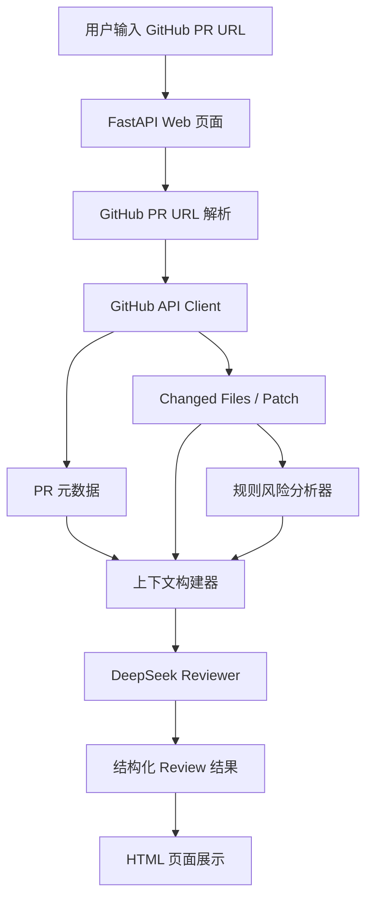

# 系统架构设计

AI PR Review Assistant 采用 Python FastAPI 实现，核心链路是“GitHub PR 数据获取 -> 规则风险分析 -> 上下文构建 -> DeepSeek 结构化评审 -> Web 展示”。

## 模块说明

- `app/github`: 解析 GitHub PR 链接并调用 GitHub API。
- `app/analyzer`: 基于路径、diff 内容和变更规模做规则扫描。
- `app/ai`: 封装 DeepSeek Chat Completions 调用，并提供无密钥 Demo 模式。
- `app/services`: 串联完整分析流程。
- `app/templates`: 展示 PR 摘要、风险项、建议和测试建议。

## 模型选择

项目默认使用 DeepSeek OpenAI 兼容接口，base URL 为 `https://api.deepseek.com`。默认模型是 `deepseek-v4-flash`，原因是速度和成本更适合 Demo 与轻量评审场景；如需更强推理能力，可通过 `DEEPSEEK_MODEL=deepseek-v4-pro` 切换。

## 上下文获取方式

系统不会无脑提交整个仓库，而是优先组织以下上下文：

- PR 标题、描述、作者、分支。
- changed files 的文件名、状态、增删行数。
- GitHub 返回的 diff patch。
- 规则分析器命中的风险项。
- PR head 分支上关键变更文件的完整内容，按敏感路径、源码文件、测试文件优先级选择，并限制文件数量和字符数。
- diff 变更行附近的局部代码上下文。Python 文件使用 AST 定位函数或类，其他语言使用上下文窗口兜底。
- 根据源码路径猜测相关测试文件并获取内容，帮助模型判断测试覆盖和回归风险。

这样可以在响应速度、成本和上下文质量之间取得平衡。

## 误报与漏报控制

- 降低误报：要求模型只评论 diff 中新增或修改代码；风险项必须说明原因和建议；低证据问题降低 severity 与 confidence。
- 降低漏报：规则分析器先标记鉴权、Token、数据库、支付、密钥、测试删除等敏感场景，再交给模型重点分析。

## 未来扩展

- 支持 GitHub App，一键把建议评论回 PR。
- 支持仓库级代码索引，获取函数级上下文。
- 支持多模型对比和二次校验，降低单模型误判。
- 支持团队规则配置，例如指定敏感目录和必测模块。
