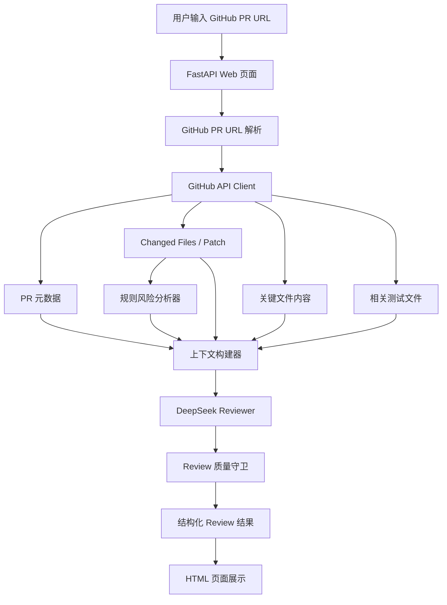

# 系统架构设计

AI PR Review Assistant 采用 Python FastAPI 实现，核心链路是：

```text
GitHub PR 数据获取 -> 规则风险分析 -> 分层上下文构建 -> DeepSeek 结构化评审 -> Review 质量守卫 -> Web 展示
```



## 模块说明

- `app/github`：解析 GitHub PR 链接并调用 GitHub API。
- `app/analyzer`：规则风险扫描、diff 行号解析、代码上下文提取、测试文件推测、Review 后处理。
- `app/ai`：封装 DeepSeek Chat Completions 调用，并提供 Demo Reviewer。
- `app/services`：串联完整分析流程，并提供 Review 缓存。
- `app/templates`：展示 PR 摘要、风险项、建议、测试建议和文件级 patch。

## 模型选择

默认使用 DeepSeek OpenAI 兼容接口，base URL 为 `https://api.deepseek.com`。

默认模型是 `deepseek-v4-flash`，原因是速度和成本更适合 Demo 与轻量评审场景；如需更强推理能力，可通过 `DEEPSEEK_MODEL=deepseek-v4-pro` 切换。

## 上下文获取方式

系统不会一次性提交整个仓库，而是优先组织以下上下文：

- PR 标题、描述、作者、分支。
- changed files 的文件名、状态、增删行数。
- GitHub 返回的 diff patch。
- 规则分析器命中的风险项。
- PR head 分支上关键变更文件的完整内容。
- diff 变更行附近的局部代码上下文。
- Python 文件使用 AST 定位函数或类，其他语言使用上下文窗口兜底。
- 根据源码路径猜测相关测试文件并获取内容。

这样可以在响应速度、成本和上下文质量之间取得平衡。

## 误报与漏报控制

- 降低误报：要求模型只评论 diff 中新增或修改代码；风险项必须说明原因和建议；低证据问题降低 severity 与 confidence。
- 降低漏报：规则分析器先标记鉴权、Token、数据库、支付、密钥、测试删除等敏感场景，再交给模型重点分析。
- 二次后处理：模型输出后过滤非变更文件、低置信度风险项，对重复建议去重，并把规则命中的风险补回结果。

## 响应速度设计

- 使用上下文预算限制控制 GitHub 内容获取和模型输入规模。
- ReviewService 维护进程内 TTL 缓存，同一个 PR URL 在缓存有效期内复用结果。
- 当前缓存适合比赛 Demo 和单实例部署；多实例部署可扩展为 Redis 或数据库缓存。

## 未来扩展

- GitHub App：一键把建议评论回 PR。
- 仓库级代码索引：获取函数级上下文、跨文件调用链和影响范围。
- 多模型对比和二次校验：降低单模型误判。
- 团队规则配置：支持敏感目录、必测模块和忽略规则。
- AI Agent 自动 Review：自动拉取 PR、分文件分析、生成草稿评论，并等待人工确认后发布。
- AI Agent 自动修复：对明确风险生成可选 patch，由开发者确认后提交修复分支。

